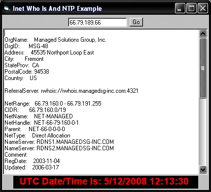



## Inet Who Is And NTP Example

### Description

I looked high, I looked low. But I couldn't find an example anywhere like this. Inet Who Is IP address lookup directly thru, yes the main database. "whois.arin.net" In 12 lines of code using a single function. No more having to go thru a middleman for simple Who Is lookups. After writing Who Is I decided to see if I could pull off NTP also. What do you know, I did ! LOL I hope this simple code is as big to you as it is to me ! If it is please vote. Enjoy !!!
 
### More Info
 

             |
---                |---
**Submitted On**   |2008-05-12 05:21:32
**By**             |[Thomas Swift](https://github.com/Planet-Source-Code/PSCIndex/blob/master/ByAuthor/thomas-swift.md)
**Level**          |Intermediate
**User Rating**    |4.6 (37 globes from 8 users)
**Compatibility**  |VB 6\.0
**Category**       |[Internet/ HTML](https://github.com/Planet-Source-Code/PSCIndex/blob/master/ByCategory/internet-html__1-34.md)
**World**          |[Visual Basic](https://github.com/Planet-Source-Code/PSCIndex/blob/master/ByWorld/visual-basic.md)
**Archive File**   |[Inet\_Who\_I2112595122008\.zip](https://github.com/Planet-Source-Code/thomas-swift-inet-who-is-and-ntp-example__1-70528/archive/master.zip)

